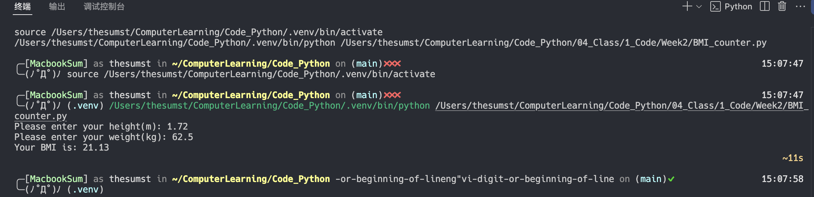
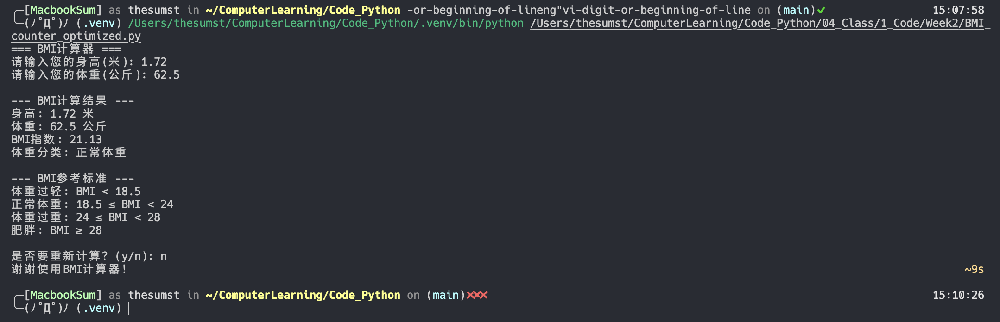

# BMI优化日志

## 未优化代码

```py
height = float(input("Please enter your height(m): "))
weight = float(input("Please enter your weight(kg): "))

bmi = weight / (height ** 2)
print(f"Your BMI is: {bmi:.2f}\n")
```

## 优化建议

Prompt:

```txt
Please help me optimize my BMI counter.
Don't use too complicated techniques.
```

## 优化后代码

```py
def get_bmi_category(bmi):
    """根据BMI值返回体重分类"""
    if bmi < 18.5:
        return "体重过轻"
    elif bmi < 24:
        return "正常体重"
    elif bmi < 28:
        return "体重过重"
    else:
        return "肥胖"

def calculate_bmi():
    """计算并显示BMI结果"""
    print("=== BMI计算器 ===")
    
    # 输入验证
    while True:
        try:
            height = float(input("请输入您的身高(米): "))
            if height <= 0 or height > 3:
                print("身高输入不合理，请重新输入！")
                continue
            break
        except ValueError:
            print("请输入有效的数字！")
    
    while True:
        try:
            weight = float(input("请输入您的体重(公斤): "))
            if weight <= 0 or weight > 500:
                print("体重输入不合理，请重新输入！")
                continue
            break
        except ValueError:
            print("请输入有效的数字！")
    
    # 计算BMI
    bmi = weight / (height ** 2)
    category = get_bmi_category(bmi)
    
    # 显示结果
    print(f"\n--- BMI计算结果 ---")
    print(f"身高: {height:.2f} 米")
    print(f"体重: {weight:.1f} 公斤")
    print(f"BMI指数: {bmi:.2f}")
    print(f"体重分类: {category}")
    
    # BMI参考表
    print(f"\n--- BMI参考标准 ---")
    print("体重过轻: BMI < 18.5")
    print("正常体重: 18.5 ≤ BMI < 24")
    print("体重过重: 24 ≤ BMI < 28")
    print("肥胖: BMI ≥ 28")

# 主程序
if __name__ == "__main__":
    calculate_bmi()
    
    # 询问是否重新计算
    while True:
        choice = input("\n是否要重新计算？(y/n): ").lower()
        if choice == 'y' or choice == 'yes':
            print()
            calculate_bmi()
        elif choice == 'n' or choice == 'no':
            print("谢谢使用BMI计算器！")
            break
        else:
            print("请输入 y 或 n")
```

### 优化点说明

1. 将BMI数据读取专门封装到一个函数中
2. 优化了输入提示
3. 增加了输入验证，防止用户输入不合理数据
4. 增加了BMI分析功能
5. 增加了BMI参考表的显示
6. 可以选择是否重新进行计算BMI

## 运行示例

### 优化前



### 优化后


