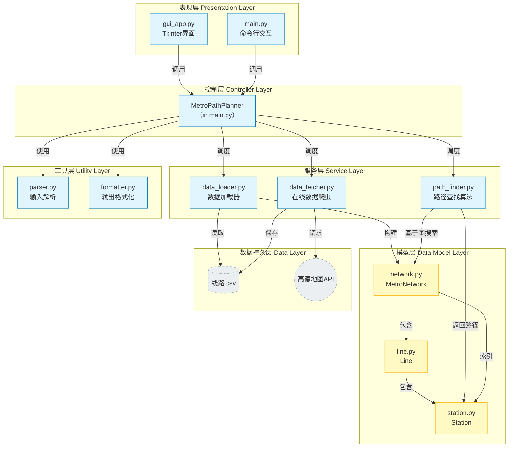

# 上海地铁换乘路径规划系统 (Shanghai Metro Path Planner)

开发者：朱文凯  
学号：23307110192  

这是一个基于 Python 开发的地铁换乘路径规划系统，以 **上海地铁** 为主要应用场景。系统支持命令行交互 (CLI) 和图形用户界面 (GUI) 两种操作模式，采用 Dijkstra 算法实现最短路径搜索，支持"最少站点"和"最少换乘"两种策略。

## 1. 主要功能

* **双模式交互**：
    * **GUI 界面**：基于 `tkinter` 和 `ttkbootstrap` 的现代化界面，支持可视化绘制路线图、站点模糊搜索、下拉选择。
    * **命令行**：支持交互式查询、单行命令参数查询及测试模式。

* **智能路径规划**：
    * **最少站点策略**：优先选择经过站点数量最少的路线。
    * **最少换乘策略**：通过调整权重，优先选择换乘次数最少的路线。
    * 自动识别并插入"换乘"标记。

* **数据管理**：
    * **在线更新**：集成爬虫模块，可从高德地图 API 实时抓取最新的上海地铁线路数据。
    * **拓扑处理**：自动处理环线（如4号线）、支线（如10号线支线）及共线站点的逻辑。

* **可视化**：
    * GUI 界面根据线路实际颜色（如1号线红色、2号线绿色）绘制站点和连线。

## 架构分析



## 2. 环境依赖与安装

本项目基于 Python 3 开发。

### 2.1. 安装依赖

项目依赖 `requests` 用于数据抓取，`ttkbootstrap` 用于美化 GUI 界面。

```bash
# 推荐先创建并使用虚拟环境
pip install -r requirements.txt
```

> **注意**：如果不安装 `ttkbootstrap`，GUI 界面可能无法启动，但命令行模式仍可部分运行（取决于具体导入依赖情况）。建议完整安装。

## 3. 运行指南

### 3.1. 启动图形界面 (GUI)

这是最直观的使用方式。

```bash
python src/gui_app.py
```

* **操作**：在左侧栏输入或选择起点和终点，选择策略，点击“查询路线”。
* **更新数据**：点击“更新数据”按钮可在线下载最新线路信息。
* **查看全网**：点击“查看线路图”可浏览所有线路和站点列表。

### 3.2. 启动命令行 (CLI)

命令行模式将被弃用，此处仅记录接口，不推荐使用  

**交互模式**：  

```bash
python src/main.py
```

进入程序后，按提示输入查询。例如输入：`18号线，复旦大学-10号线，交通大学`。

## 4. 📂 项目结构

```text
project_root/
├── doc/                        # 数据存储目录
│   └── 线路.csv                 # 地铁线路数据文件（自动生成）
├── src/                        # 源代码目录
│   ├── config.py               # 配置文件（路径、线路颜色等）
│   ├── main.py                 # CLI 入口程序
│   ├── gui_app.py              # GUI 入口程序
│   ├── models/                 # 数据模型层
│   │   ├── line.py             # 线路类
│   │   ├── station.py          # 站点类
│   │   └── network.py          # 网络图类
│   ├── services/               # 业务逻辑层
│   │   ├── data_fetcher.py     # 在线数据抓取
│   │   ├── data_loader.py      # CSV 数据加载
│   │   └── path_finder.py      # 路径搜索算法 (Dijkstra)
│   └── utils/                  # 工具层
│       ├── parser.py           # 输入解析
│       └── formatter.py        # 输出格式化
└── README.md                   # 说明文档
```

## 5. 核心算法与逻辑

### 5.1. 数据结构

* **Station**: 存储站点 ID、名称、所属线路以及 `next_station` (后继)、`prev_station` (前驱) 和 `transfer_stations` (换乘) 的引用。
* **MetroNetwork**: 维护全网的站点索引（按 ID、按名称）和线路集合。

### 5.2. 搜索算法 (Dijkstra)

位于 `src/services/path_finder.py`。
算法通过优先队列（最小堆）维护搜索路径，根据策略动态计算权重：

1. **相邻站点权重**：同线路相邻站点权重默认为 1.0。
2. **换乘权重**：
    * **最少站点模式**：换乘权重设为 1.0（视作普通一站）。
    * **最少换乘模式**：换乘权重设为 1000.0（大幅增加代价，迫使算法寻找不换乘的路径）。
    * **同台换乘/虚拟换乘优化**：代码包含对同名不同线站点的检测，给予极低权重 (0.1) 以鼓励合理的内部换乘逻辑。

### 5.3. 数据获取

位于 `src/services/data_fetcher.py`。

* 通过高德地图 API 获取 JSON 数据。
* **数据清洗**：
    * 处理环线闭合（将首站复制一份到末尾并标记）。
    * 处理重名线路（自动识别主线与支线，如"11号线(支线)"）。
    * 自动计算换乘关系（基于同名站点聚合 ID）。

## 6. 配置说明

配置文件位于 `src/config.py`。

* **DEFAULT_DATA_FILE**: 默认数据存储路径，通常为 `doc/线路.csv`。
* **LINE_COLORS**: 定义了 GUI 界面中各条线路的显示颜色。

## 7. 常见问题

1. **启动时提示 "系统未初始化" 或找不到文件？**
    * 首次运行请先在 GUI 中点击“更新数据”，或确保 `doc/` 目录下存在合法的 `线路.csv` 文件。

2. **输入格式错误？**
    * CLI 模式严格遵循格式：`线路名，站名-线路名，站名`（中间用连字符，逗号支持中英文）。
    * 例如：`1号线，上海火车站-2号线，人民广场`。
    * 如果只输入站名（如 `上海火车站-人民广场`），系统会自动推断，但若存在歧义（多线经过同名站）可能会报错提示指定线路。

---
