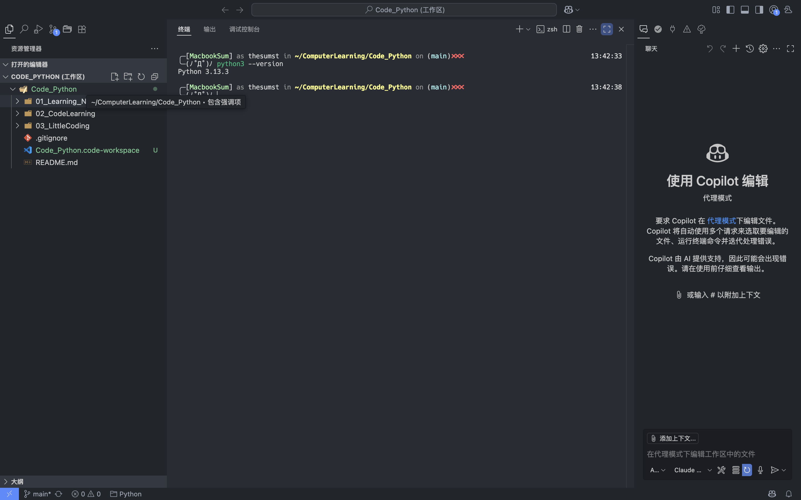
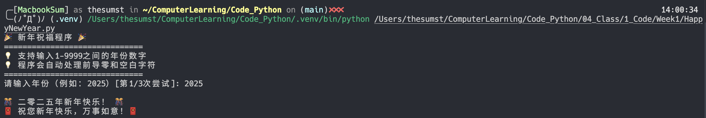

# Python Programming Week1 Homework

Author: 朱文凯  
Student ID: 23307110192  

## 1. Homework 1: 环境配置

  

## 2. Homework 2: AI 开发日志

### 2.1. Introduction

Program: 新年祝福程序  
Feature: 读入用户输入的年份，然后输出对应的中文新年祝福语  

### 2.2. Development Log

Extension: Copilot  
Model: Claude Sonnet 4
Prompts:  

- first

    ```txt
    prompt: please help me develop an easy program, 
    which can take the user input(year as number, e.g. 2025) 
    and then output happy new year in the form like "二零二五年新年快乐"
    ```

- second

    ```txt
    prompt: please help me improve the program to enable it to handle more abnormal or incorrect input
    ```

    improved parts:  
    1. 增强输入验证 - 检查空输入、非数字字符、年份范围(1-9999)
    2. 自动处理前导零和空白字符
    3. 支持多次重试输入 (最多3次)
    4. 更详细的错误提示信息
    5. 添加测试模式来验证各种输入场景
    6. 增强异常处理和错误恢复机制
    7. 改进用户体验，提供清晰的操作指导

### 2.3. Final Code

[HappyNewYear.py](./HappyNewYear.py)  

  
