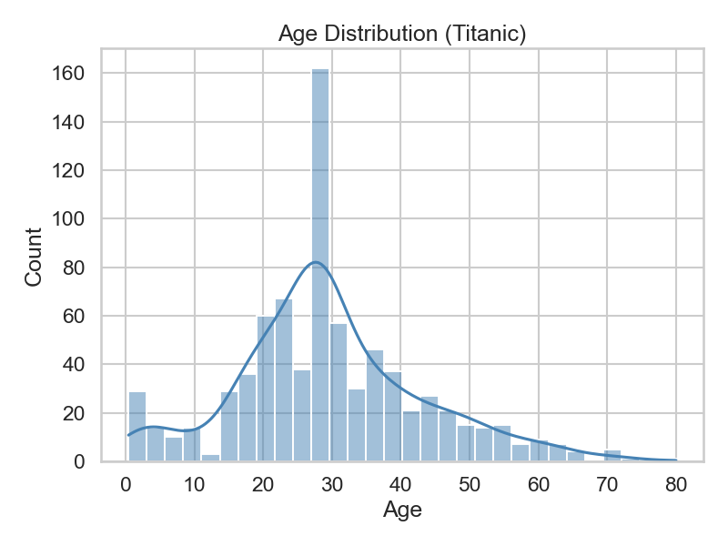
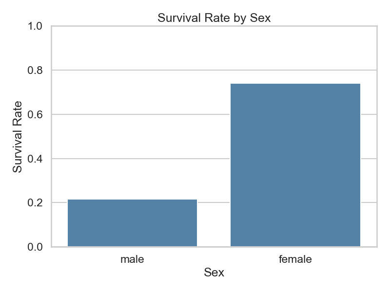
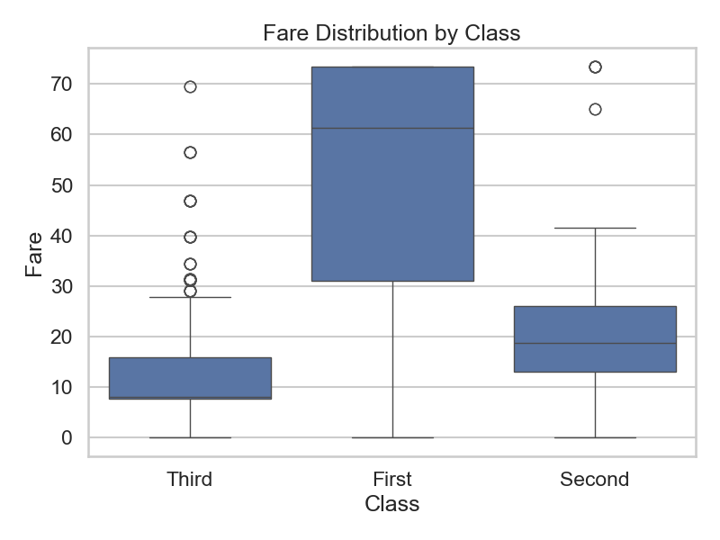
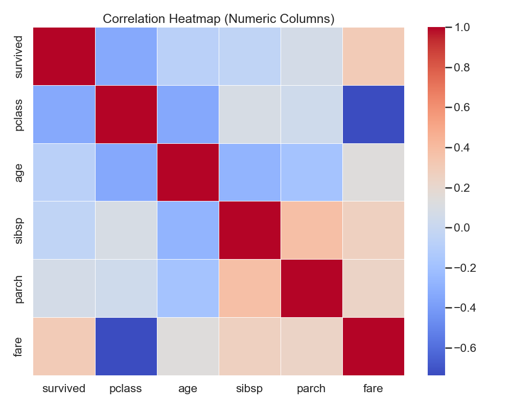

# Lab 13 简短报告

## 数据集与来源

- 数据集名称：Seaborn Titanic（泰坦尼克号乘客数据）
- 获取方式：seaborn 内置加载（无需下载/注册），代码：`sns.load_dataset('titanic')`
- 字段概览：survived, pclass, sex, age, sibsp, parch, fare, embarked, class, who, adult_male, deck, embark_town, alive, alone

## 清洗策略与效果

- 缺失值：
    - 数值列（age, fare 等）用中位数填充，降低均值受极端值影响；
    - 分类列（embarked, embark_town, deck 等）用众数或 "Unknown" 填充；
    - 填充后各列缺失计数为 0，保证绘图与后续分析顺畅。
- 重复值：
    - 检测到 112 条重复记录，已使用 `drop_duplicates()` 去除；
    - 有助于减少重复样本带来的统计偏差。
- 异常值（以 fare 为例）：
    - 使用 IQR（四分位距）法计算上下界（约 -31.17 到 73.42），对票价进行裁剪（clip）；
    - 处理前异常 102 条，处理后异常 0 条；
    - 选择裁剪而非删除，保留样本同时降低极端值影响。

## 图表与发现（见 figures/）

- 图1：`01_age_distribution.png`（age 分布直方图 + KDE）
    - 发现：年龄集中在 20-40 岁区间，儿童与高龄人群占比相对较低；分布呈右偏态。
- 图2：`02_survival_rate_by_sex.png`（按性别的存活率条形图）
    - 发现：女性存活率显著高于男性，符合“女士与儿童优先”历史背景；性别是强影响因子。
- 图3：`03_fare_boxplot_by_class.png`（不同舱位的票价箱线图）
    - 发现：票价随舱位等级升高而显著增大，头等舱离散度更大、存在高价异常值；经济舱集中在低票价区间。
- 图4（可选）：`04_correlation_heatmap.png`（数值列相关性热力图）
    - 观察：pclass 与 fare 呈较强负相关（等级越高票价越高，pclass 数值越小）；sibsp/parch 与 alone 相关。

## 结论与建议

- 结论：
    - 性别与舱位等级与存活率有显著关系；票价与舱位等级强相关，反映社会经济差异；年龄分布右偏，青年占多数。
- 局限性：
    - `deck` 等列缺失严重（>70%），填充可能引入噪声；
    - 数据主要为横截面，缺少时间维度与更丰富的行为信息；
    - 简单裁剪异常值可能影响真实分布尾部特征。

## 附：图表文件

- 已生成图表位于 `figures/` 目录：
    - `01_age_distribution.png`  
        
    - `02_survival_rate_by_sex.png ` 
        
    - `03_fare_boxplot_by_class.png`  
        
    - `04_correlation_heatmap.png`  
        
