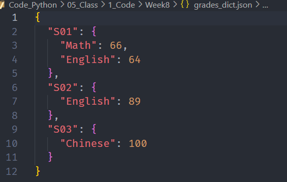
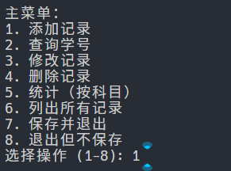
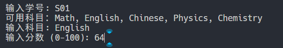
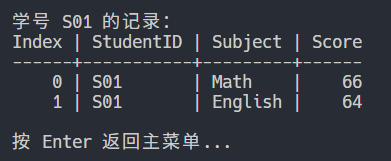
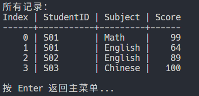
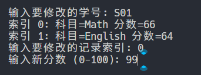
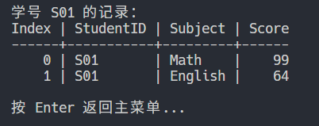
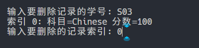
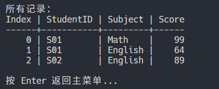
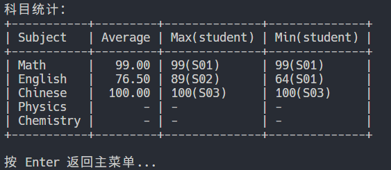

# Student Grade Manager (Dictionary Version): 学生成绩管理系统（字典版）

## 概述

本周版本将核心数据结构从“列表+字典项”重构为“字典为主”。功能与上一周基本一致（增删改查、按科目统计、保存/加载、交互式菜单、`--demo` 演示），主要变化是存储结构与相应的操作方式更新。

## 数据模型

- 内存结构：`Dict[str, Dict[str, int]]`
    - 键：学号（如 `"S001"`）
    - 值：该学号下“科目 -> 分数”的映射（如 `{"Math": 95, "English": 88}`）

- 持久化文件：`grades_dict.json`
    - JSON 结构示例：

      ```json
      {
        "S001": {"Math": 95, "English": 88},
        "S002": {"Math": 76},
        "S003": {"Physics": 89}
      }
      ```

- 兼容性：如果发现旧版（列表版）的 JSON，加载时会自动转换为字典结构（仅在内存中），保存后即写成字典格式。

## 文件说明

- `gm_data.py`
    - `DATA_FILE = grades_dict.json`
    - `load_data()`：加载为字典结构，统计并返回跳过的异常条数
    - `save_data()`：写入字典结构 JSON

- `gm_core.py`
    - 校验：`valid_student_id/valid_subject/valid_score`
    - CRUD：`add_record`、`update_record`、`delete_record`
    - 查询：`list_student_subjects(records, sid)` 返回该学号下的 `(科目, 分数)` 列表
    - 统计：`subject_statistics(records)` 返回每科的平均/最高/最低/样本数

- `gm_display.py`
    - 终端清屏与暂停
    - 记录展示：将字典结构按行扁平化（`StudentID / Subject / Score`），支持按学号过滤
    - 统计展示：`Subject / Average / Max(student) / Min(student)` 表格
    - 中英文对齐：默认英文表头，内置 wcwidth 适配（若安装）

- `grade_manager.py`
    - 主循环菜单（中文提示）
    - `--demo`：演示增/改/删/查/统的典型流程（使用内存数据，不读写文件）

## 交互变化要点（相对列表版）

- 修改与删除：不再使用“全局索引”，而是：先输入学号 → 列出该学号下的科目清单（带索引）→ 选择科目 → 执行修改或删除。
- 查询：输入学号后直接展示该学号下所有科目成绩。

## 运行

- 交互模式：直接运行 `grade_manager.py`
- 演示模式：`grade_manager.py --demo`

（Windows PowerShell 直接运行即可；也可在 VS Code 终端中运行。）

## 统计表说明

- 平均分保留两位小数
- 最高/最低显示为：`分数(学号)`，若无数据则为 `-`

## 后续可选改进

- 支持动态增加科目集合
- 导入/导出 CSV
- 按学号或科目排序显示

## 运行展示

### 测试数据

  

### 主界面

  

### 增加记录: C

  
  

### 搜索记录: R

  

搜索单个学生，在上面C部分的第二张就是  

### 修改记录: U

  


### 删除记录: D

  
  

### 统计分析: S

  
